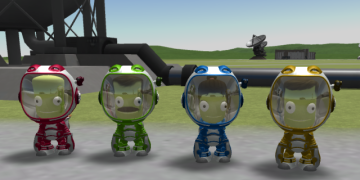
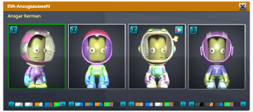

 Changelog
---------
Record of all notable changes made to the [Kerbal Suitcase](readme.md).

### 0.5 - dinkelstein update

* added different icons for all dinkelstein suit types

&#160;&#160;&#160;

&#160;&#160;&#160;

&#160;&#160;&#160;

___
### 0.4 - future colors

* added red, green, blue, yellow and orange future suit colors

___
### 0.3 - dinkelstein construction

* added dinkelstein construction suits for all suit types

___
### 0.2 - browncoats (sepia filter for the win)

* added Default/Sepia Suits (browncoats)
* added new icons (male and female)

___

### 0.1 - initial commit (preparation and resources)

* created source pdn files with layers for id and uv maps
* created simple clown suits for orientation and testing
* created a custom clown suit icon from the sample files

