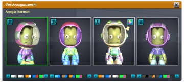

<h2>

Kerbal Suitcase
<small>A small collection of nicely colored suits for the [Kerbal Space Program](https://www.kerbalspaceprogram.com/) suit picker.</small>
</h2>

Inspired by [Make your own custom colored suits with Kerbal Space Program 1.10: "Shared Horizons"](https://forum.kerbalspaceprogram.com/index.php?/topic/195242-make-your-own-custom-colored-suits-with-kerbal-space-program-110-shared-horizons/),  
[Making custom colored suits with Kerbal Space Program 1.12: "On Final Approach"](https://forum.kerbalspaceprogram.com/index.php?/topic/203405-making-custom-colored-suits-with-kerbal-space-program-112-on-final-approach/)  
and the [The Spacesuit exchange thread!](https://forum.kerbalspaceprogram.com/index.php?/topic/195560-the-spacesuit-exchange-thread/)

Should work with version 1.10 and above. Check the [changelog](changelog.md) for the current list of provided suits.

If you have TextureReplacer installed, you might need to untick the "customise kerbal suits" option.
